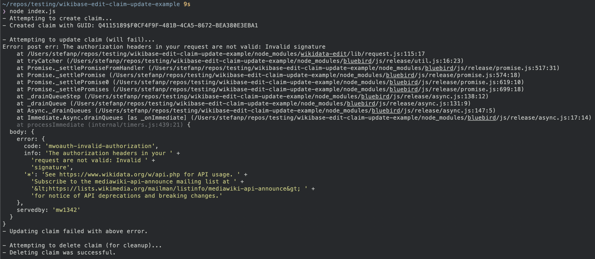

**Note: The error was fixed in wikibase-edit v3, but there is still a bug with OAuth that's waiting to be fixed: https://github.com/maxlath/wikibase-edit/pull/39**


This is a test repository to demonstrate the bug in [wikibase-edit](https://github.com/maxlath/wikibase-edit) (or potentially Wikibase itself) that is described here: https://github.com/maxlath/wikibase-edit/issues/34

Apparently, if you use OAuth authentication, only `claim.update` fails to authenticate while other actions work. This repository demostrates that behavior by creating a claim, trying to update it, and deleting it again. You'll see that creating and deleting works, but updating does not.

## How to run

First, clone the repository and install the dependency (which is wikibase-edit):
```bash
git clone https://github.com/stefandesu/wikibase-edit-claim-update-example.git
cd wikibase-edit-claim-update-example
npm i
```

Then, create a `config.json` file with your OAuth credentials and instance like this:
```json
{
  "instance": "https://www.wikidata.org",
  "credentials" :{
    "oauth": {
      "token": "...",
      "token_secret": "...",
      "consumer_key": "...",
      "consumer_secret": "..."
    }
  }
}
```
(Note that this assume you already have a registered OAuth consumer and the token+token_secret for an authorized user for that consumer.)

Optional: In `index.js`, you can adjust which entity is going to be used for the test and which claim should be created. By default, [Wikidata Sandbox](https://www.wikidata.org/wiki/Q4115189) is used with a claim for [Basisklassifikation](https://www.wikidata.org/wiki/Property:P5748).

Finally, run the script and see the error:
```bash
node index.js
```

Here's what the output should look like:



If, for some reason, deleting the created claim was not successful, please remove the claim manually so that the test will work in the future as well.
